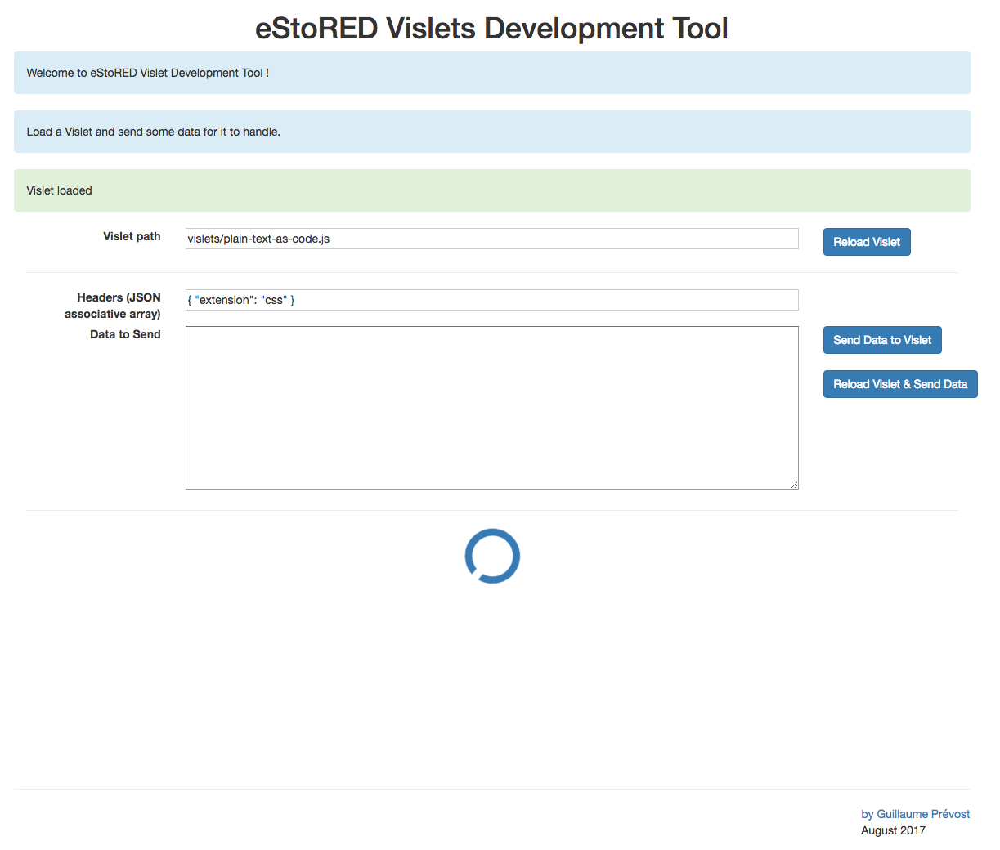
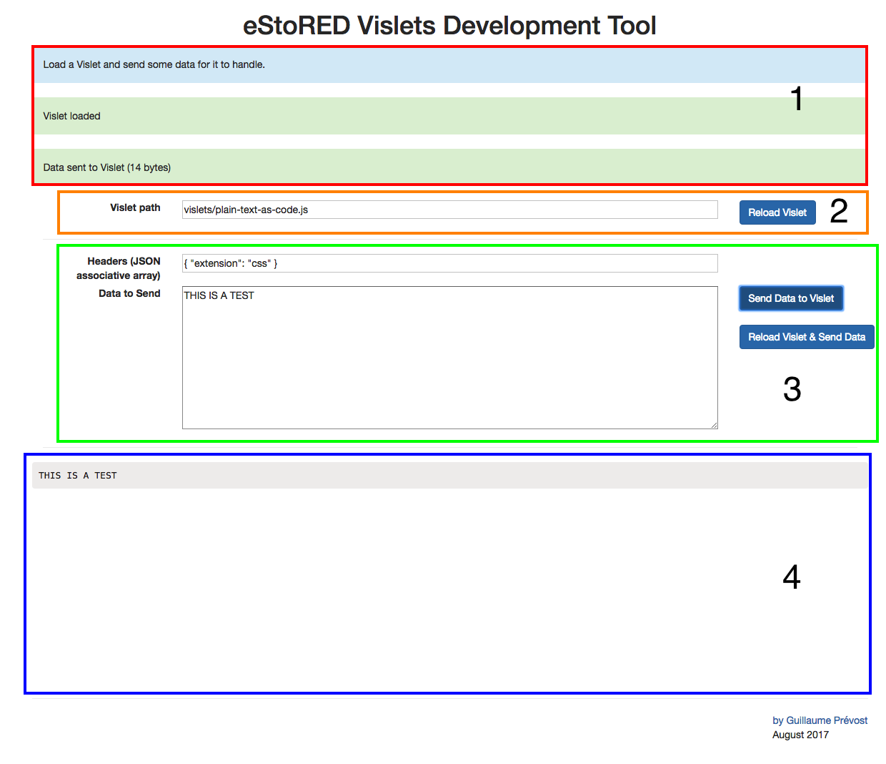

# eStoRED Visualisers Development Tool

This is a small supporting tool for eStoRED for an easy way to develop eStoRED Visualisers (Vislets).

It allows loading Vislets code into the page and sending data to it, simulated the reception of messages via the Message Broker if it were used into eStoRED architecture.

Here is a screen capture of what the interface looks like:



The page is a static HTML page: *index.html* that can be opened directly in a browser from the file system, without a web server. It includes the following utilities libraries: *Bootstrap, jQuery, jQuery UI, UnderscoreJS*.


# How to use it:

The page is divided in 4 sections:  



### 1. Notifications log

The top section (marked as 1 in the picture) is displaying a log of what events are hapening on the page (Vislet loading, sending data, etc.)

### 2. Vislet Path

The Vislet path section (marked as 2 in the picture)  allows changing which Vislet is being used for visualisation. A relative path can be used. A few existing Vislets are under the */vislets* folder.

When the path is changed, click on the **Reload Vislet** button to change the Vislet being used. This button can also be used to reset the Vislet (re-running the Vislet's initialize() method).

### 3. Data

The data section (marked as 3 in the picture) part simulates the messages containing data, that the message broker would send as part of the eStoRED architecture. Here the headers can be configured as a JSON object:

Example: ``` { "extension": "css" } ```

The data to send can be copy/pasted into the text area below. A few data files examples are available under the folder */datafiles*. After settings the headers and data payload, click on the **Send Data to Vislet** button to trigger the *visualizeData()* method which should update the display.

The button underneath **Reload Vislet & Send Data** both re-initialises the Vislet and re-send the data.

### 4. Visualisation

The Visualisation section (marked as 4 in the picture) is The output of the Vislet. It is just an empty DIV container that each Vislet will populate differently.

Loading a Vislet and sending it some data will update the visualisation.

Look into the Javascript Console of your Web Browser (in developer mode) to see any log or error messages from the Vislet.

# License

eStoRED Visualiser Development Tool software is distributed under the 3-clause "New" BSD License.  
See [License.txt](https://bitbucket.org/eresearchrmit/estored/src/master/LICENSE.txt) file.
